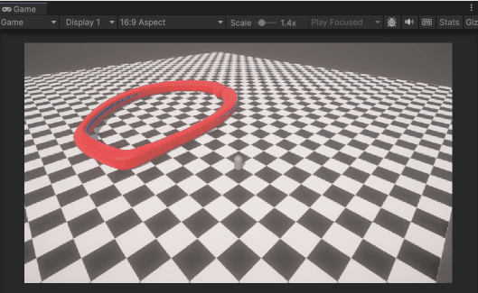
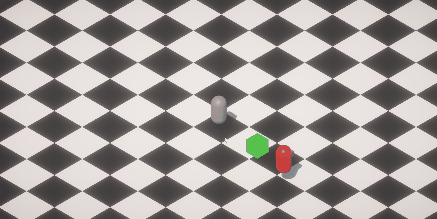

# MyVampireSurvivor
Practice for DOTS  
Doing Features
+ user input
+ enemy movement using navigation mesh
  + collision checking

Todo Features
+ Item
  + skill scroll
  + item box
  + combine item
  + inventory

+ Skill
  + passive skill( damage up, more life)
  + active skill

+ enemy
  + enemy middle boss

+ projectile

+ multiplay

+ 2023.11.07 

속도가 너무 느려서 GameObject로 개발하고 DOTS로 포팅할거다
- GameObject github주소  
https://github.com/jjr2930/MyVampireSurvivorGO
